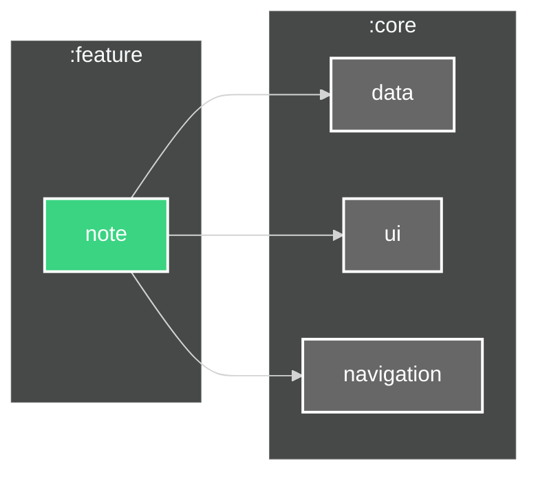

# `:feature:note` Module

##

This module implements the note editing and viewing functionality for the HNotes application. It
provides a rich text editor interface for creating and modifying individual notes.

## Features

- Rich text editor with formatting options
- Note title and content editing
- Auto-save functionality
- Share note functionality
- Delete note option
- Last modified timestamp
- Category/label assignment
- Color selection for notes
- Pin/unpin note option

## Dependencies

## Screenshots

The note module provides a clean, focused interface for note creation and editing. Screenshots will
be available once the note editor UI is finalized.

To add screenshots:

1. Capture the note editor screen in both light and dark themes
2. Save them in the `assets/screenshots` directory as:
    - `Note_Editor_Light.png`
    - `Note_Editor_Dark.png`

The note editor interface uses Material Design components and follows the app's design system for a
consistent user experience. It provides a distraction-free environment for note-taking while
maintaining quick access to formatting tools and note options.