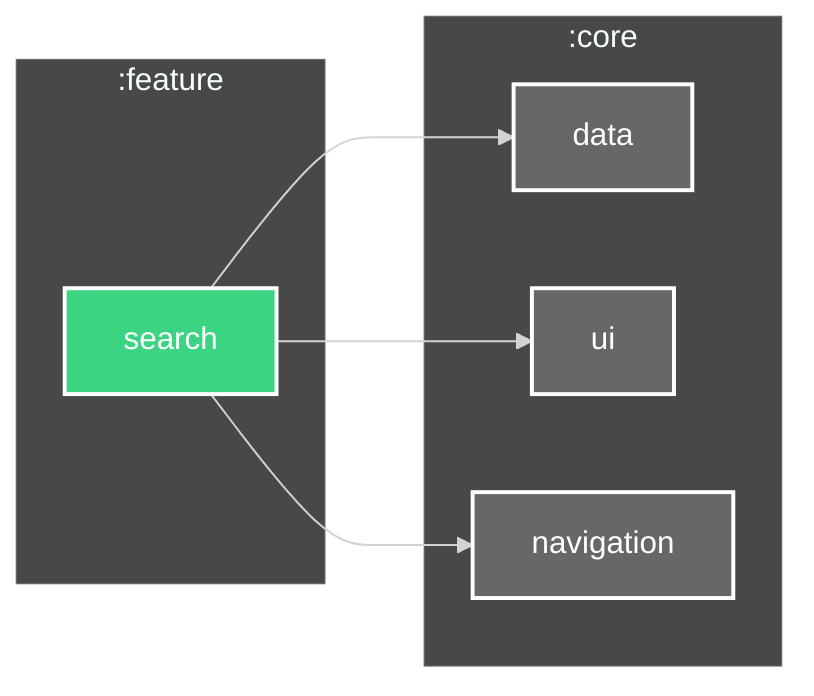

# `:feature:search` Module

---

##

This module implements the search functionality for HNotes application, allowing users to find
specific notes quickly through text-based search.

## Features

- Real-time search as you type
- Search through note titles and content
- Empty search results handling
- Search history (recent searches)

## Dependencies

## Screenshots

The search module provides a powerful search interface that helps users quickly find their notes. It
features a search bar at the top of the screen with real-time results updating as the user types.
The search functionality covers both note titles and content, making it easy to locate specific
information within the app.
