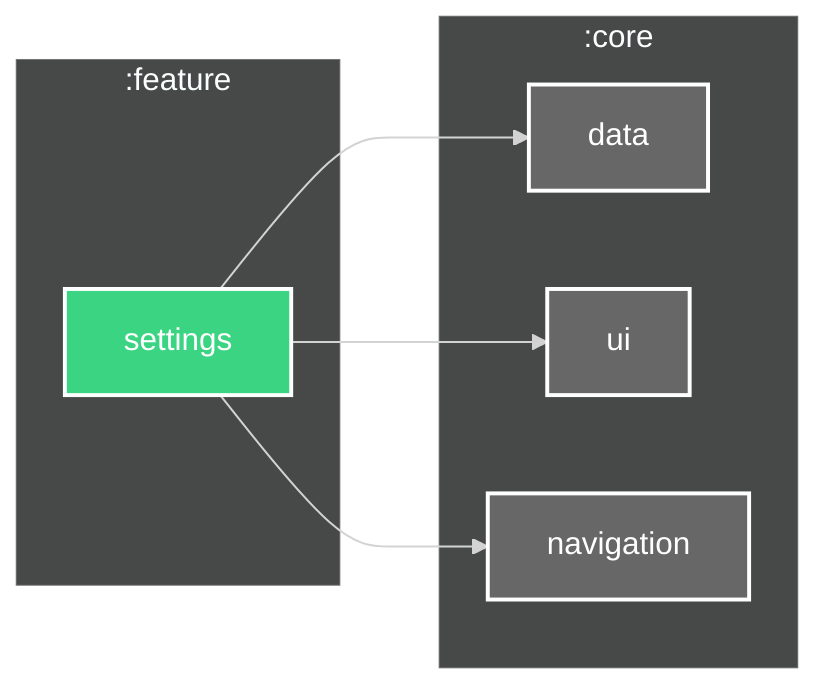

# `:feature:settings` Module

```mermaid
%%{
  init: {
    'theme': 'dark'
  }
}%%

graph LR
  subgraph :feature
    :feature:settings["settings"]
  end
  subgraph :core
    :core:data["data"]
    :core:ui["ui"]
    :core:navigation["navigation"]
  end

  :feature:settings --> :core:data
  :feature:settings --> :core:ui
  :feature:settings --> :core:navigation

classDef android-library fill:#3BD482,stroke:#fff,stroke-width:2px,color:#fff;
classDef unknown fill:#676767,stroke:#fff,stroke-width:2px,color:#fff;
class :feature:settings android-library
class :core:data unknown
class :core:ui unknown
class :core:navigation unknown

```