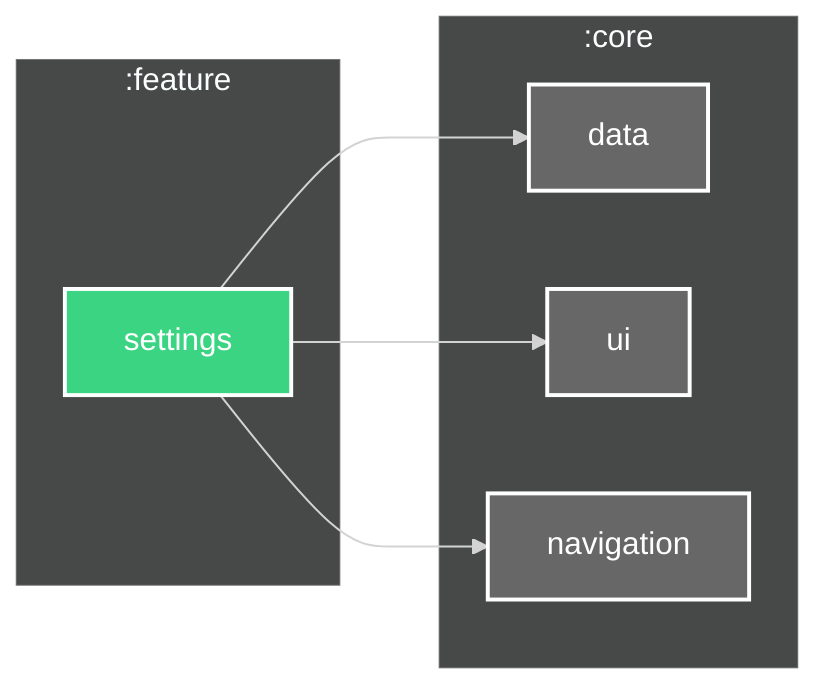

# `:feature:settings` Module

---

##

This module implements the settings and configuration functionality for the HNotes application,
allowing users to customize their app experience and manage various preferences.

## Features

- Theme selection (Light/Dark/System)

## Dependencies

## Screenshots

The settings module provides a user-friendly interface for configuring app preferences. It uses
Material Design components to present settings in an organized, easy-to-navigate format. Users can
customize their experience through various options while maintaining a clean and intuitive
interface.
